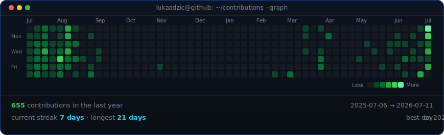

<!--
  Profile README for github.com/lukaadzic — rendered on the GitHub profile
  page because this repo is named exactly after the username. Portrait +
  info card sit in a table at widths 370/490 so they match height; the
  contribution graph refreshes daily via .github/workflows/update-profile-art.yml.

  This repo is also the source for lukaadzic.dev (the Next.js app in
  app/, components/, lib/) — see CLAUDE.md for that project. The animated
  assets here (ascii-portrait.svg, info-card.svg, contrib-heatmap.svg,
  scripts/, data/) are unrelated to the app and only exist to drive this
  README.
-->

<table>
<tr>
<td valign="top"></td>
<td valign="top"></td>
</tr>
</table>

## LUKA ADZIC

**Building & Compiling**

 

<!-- animated contribution graph, refreshed daily by the workflow -->

