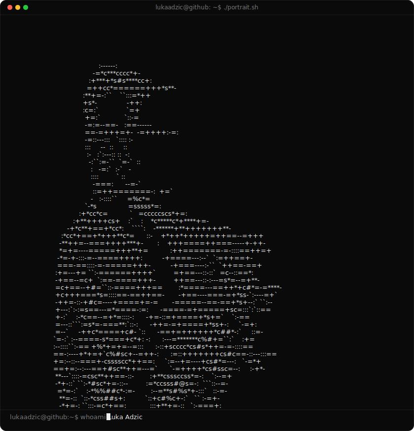

<!--
  Profile README for github.com/lukaadzic — rendered on the GitHub profile
  page because this repo is named exactly after the username. Palette and
  fonts match lukaadzic.dev (see app/globals.css) so this reads as the same
  product as the site, not a generic github template.

  This repo is also the source for lukaadzic.dev (the Next.js app in
  app/, components/, lib/) — see CLAUDE.md for that project. ascii-portrait.svg
  and scripts/ are unrelated to the app and only exist to drive this README.
  Re-run scripts/prep_photo.py + scripts/make_ascii_svg.py to regenerate it
  after a tweak.
-->

## Luka Adzic

**Building & Compiling**

[lukaadzic.dev](https://lukaadzic.dev) • [LinkedIn](https://linkedin.com/in/lukaadzic/) • [Instagram](https://www.instagram.com/lukaadzic7/)

