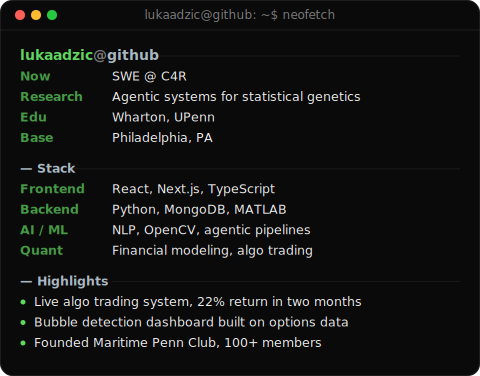

<!--
  Profile README for github.com/lukaadzic — rendered on the GitHub profile
  page because this repo is named exactly after the username. Portrait +
  info card sit in a table at widths 370/490 so they match height. Palette
  and fonts match lukaadzic.dev (see app/globals.css) so this reads as the
  same product as the site, not a generic github template.

  This repo is also the source for lukaadzic.dev (the Next.js app in
  app/, components/, lib/) — see CLAUDE.md for that project. The two
  assets here (ascii-portrait.svg, info-card.svg, scripts/) are unrelated
  to the app and only exist to drive this README. Re-run scripts/prep_photo.py
  + scripts/make_ascii_svg.py or scripts/make_info_card.py to regenerate
  either one after a tweak.
-->

<table>
<tr>
<td valign="top"></td>
<td valign="top"></td>
</tr>
</table>

## Luka Adzic

**Building & Compiling**

[lukaadzic.dev](https://lukaadzic.dev) • [LinkedIn](https://linkedin.com/in/lukaadzic/) • [Instagram](https://www.instagram.com/lukaadzic7/)

